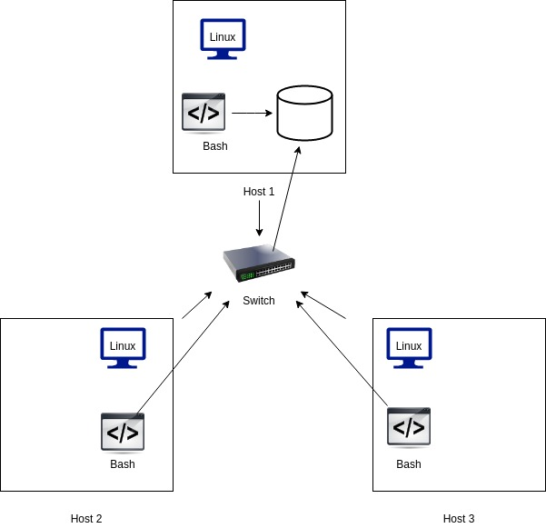

# Linux Cluster Monitoring Agent
# Introduction
The Linux Cluster Monitoring Agent tool help users to record the hardware specifications of each node in a linux cluster and monitor the resource usage at a particular interval of time. Thus, it enhances the decision-making ability of a resource manager.    
# Quick Start 
- Start a psql instance using psql_docker.sh
````bash
./scripts/psql_docker.sh start
````
- Create tables using ddl.sql
````bash
./sql/ddl.sql 
````
- Insert hardware specs data into the db using host_info.sh
````bash
./scripts/host_info.sh psql_host psql_port db_name psql_user psql_password
````
- Insert hardware usage data into the db using host_usage.sh
````bash
starscripts/host_usage.sh psql_host psql_port db_name psql_user psql_passwordt
````
- Crontab setup
````bash
crontab -e
````

# Implementation
A postgreSQL instance is provisioned by creating and starting a docker container. The program is implemented using linux command lines and scripts like host_info.sh and host_usage.sh are used to insert data and ddl.sql is used to create tables. At last, crontab is set up to monitor the usage for a specific time interval.
## Architecture

## Scripts
- psql_docker.sh::
  This script creates psql instance with the given database name and password using docker and allows user to access it on the local machine.  
  ````bash
    ./scripts/psql_docker.sh start|stop|create (db_username)(db_password)
    ````
- host_info.sh::
This script runs only once assuming hardware data is static and allows user to collect hardware specifications which is then inserted into the database table called host_info(psql instance)
````bash
./scripts/host_info.sh psql_host psql_port db_name psql_user psql_password
````  
- host_usage.sh::
This script collects the server usage data and is executed repeatedly in a specific interval of time and then stores data to psql database    
````bash
.scripts/host_usage.sh psql_host psql_port db_name psql_user psql_password
````
- crontab
Crontab helps to execute the psql_usage.sh script every minute and collect the usage data. 
## Database Modeling 
# Test 
# Improvements


